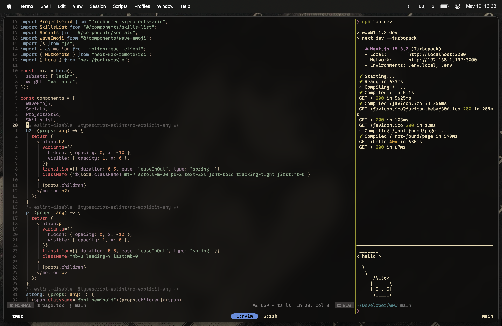

# 🎨 Dotfiles

My development focused setup for macOS.



## 📦 Tools

The stuff I use the most.

- [Zen Browser](https://zen-browser.app/) - A very nice browser.
- [Raycast](https://raycast.com/) - Application launcher for macOS.
- [AeroSpace](https://github.com/nikitabobko/AeroSpace) - i3-like tiling window manager for macOS.
- [Homebrew](https://brew.sh/) - Package manager for macOS.
- [iTerm2](https://iterm2.com/) - Terminal emulator for macOS.
- [Neovim](https://neovim.io/) - Text editor.
- [tmux](https://github.com/tmux/tmux) - Terminal multiplexer.

## ⚙️ Install

### 🧱 Requirements

Should work on any macOS version with `git` and `curl` installed (I think 🤷‍♂️).

### 🔮 General

Install and configure most of the needed tools.

1. Install the [Homebrew](https://brew.sh/) package manager.
2. Install the dotfiles by running the following in your home directory:
   ```bash
   # This clones the dotfiles, installs many dependencies, and stows the dotfiles.
   curl -sSfL https://raw.githubusercontent.com/mvahaste/dotfiles/main/install.sh | sh
   ```
3. Close and reopen your terminal to configure Powerlevel10k or run `p10k configure`.
4. Run `tmux` and install plugins with `<prefix>I`.
5. Run `nvim` and install mason dependencies with `:MasonToolsInstall`.

### 💻 iTerm2

Make iTerm2 nicer to use and look at.

1. Import the profile from `~/dotfiles/mvahaste.json`
2. Set the following options manually:
   - General
     - Confirm closing multiple sessions: `false`
     - Confirm quititng iTerm2: `false`
   - Appearance
     - General
       - Theme: `Minimal`
     - Panes
       - Side margins: `10`
       - Top & bottom margins: `7`
